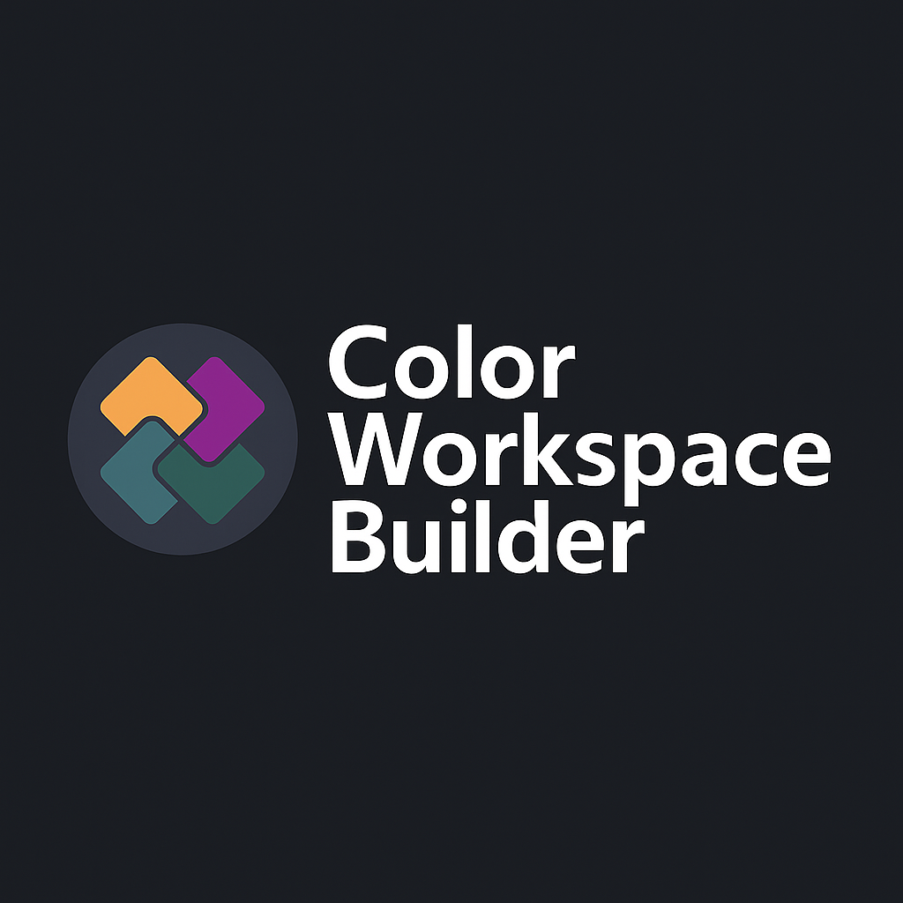

# Color Workspace Builder

A mini-app for creating and managing color palette workspaces, designed for theme configuration of SDK coding environments.



## Features

- **Color Palette** — Browse curated color combinations with selectable swatches
- **Workspace Builder** — Assign colors to 6 theme roles (background, foreground, keyword, string, comment, function) via drag-and-drop or click-to-fill
- **Live Code Preview** — Real-time syntax-highlighted code preview reflecting your theme
- **Built-in Themes** — Dracula, One Dark, VSCode Dark presets
- **Custom Themes** — Create, rename, and delete your own themes
- **WCAG Contrast Checking** — Automatic contrast ratio calculation with AA pass/fail badges and toast warnings
- **Dark/Light Mode** — Full app-level dark/light toggle
- **Import/Export** — Save and load themes as JSON files
- **Persistence** — All themes and preferences cached in localStorage
- **Responsive** — Desktop (2-column) and tablet (stacked) layouts

## Tech Stack

| Category | Technology |
|----------|-----------|
| Framework | React 18 |
| Build Tool | Vite 5 |
| Language | TypeScript |
| Styling | Tailwind CSS v3 |
| UI Components | shadcn/ui (Radix UI primitives) |
| State Management | Zustand (with persist middleware) |
| Drag & Drop | @dnd-kit |
| Testing | Vitest + React Testing Library |
| CI/CD | GitHub Actions + Vercel |

## Getting Started

### Prerequisites

- Node.js >= 18
- npm >= 9

### Setup

```bash
# Clone the repository
git clone https://github.com/trihoang/project-sample.git
cd project-sample

# Install dependencies
npm install

# Start development server
npm run dev
```

The app will be available at `http://localhost:5173`.

### Available Scripts

| Command | Description |
|---------|-------------|
| `npm run dev` | Start development server with HMR |
| `npm run build` | Type-check and build for production |
| `npm run preview` | Preview production build locally |
| `npm run lint` | Run ESLint |
| `npm run test` | Run unit tests (watch mode) |
| `npx vitest run` | Run unit tests (single run) |

## Project Structure

```
src/
├── components/
│   ├── ui/                        # shadcn/ui primitives (Button, Badge, Dialog, etc.)
│   └── layout/
│       ├── AppHeader.tsx           # Logo, dark mode toggle, import/export
│       └── AppLayout.tsx           # Main layout with DnD context
├── features/
│   └── workspace/
│       ├── components/
│       │   ├── PalettePanel/       # Color palette sidebar
│       │   ├── WorkspacePanel/     # Theme role slots + theme selector
│       │   └── CodePreview/        # Live syntax-highlighted preview
│       ├── hooks/                  # usePalette, useWorkspace
│       ├── stores/                 # Zustand store with localStorage persist
│       ├── services/               # Palette data loader, theme presets
│       └── types.ts                # ThemeRole, PaletteColor, WorkspaceTheme
├── lib/
│   ├── colorUtils.ts               # WCAG contrast ratio calculations
│   └── utils.ts                    # Tailwind cn() helper
└── data/
    └── combinations.json           # Curated color combinations
```

## How It Works

1. **Browse** color combinations in the left palette panel
2. **Click** a color swatch to auto-fill the next empty role slot, or **drag** it to a specific slot
3. **Switch** between built-in themes (Dracula, One Dark, VSCode) or create custom ones
4. **Preview** your theme in the live code preview panel
5. **Export** your theme as JSON to share or back up

## CI/CD

- **CI** (`ci.yml`): Runs lint, tests, and build on push to `develop`/`main` and PRs to `main`
- **Deploy** (`deploy.yml`): Auto-deploys to Vercel (production) on push to `main`

### Required Secrets

Add these secrets in GitHub repo Settings → Secrets → Actions:

| Secret | Description |
|--------|-------------|
| `VERCEL_TOKEN` | API token from [Vercel Settings → Tokens](https://vercel.com/account/tokens) |
| `VERCEL_ORG_ID` | Organization ID (from `npx vercel link` → `.vercel/project.json`) |
| `VERCEL_PROJECT_ID` | Project ID (from `npx vercel link` → `.vercel/project.json`) |

## License

This project is part of a frontend developer assessment.
